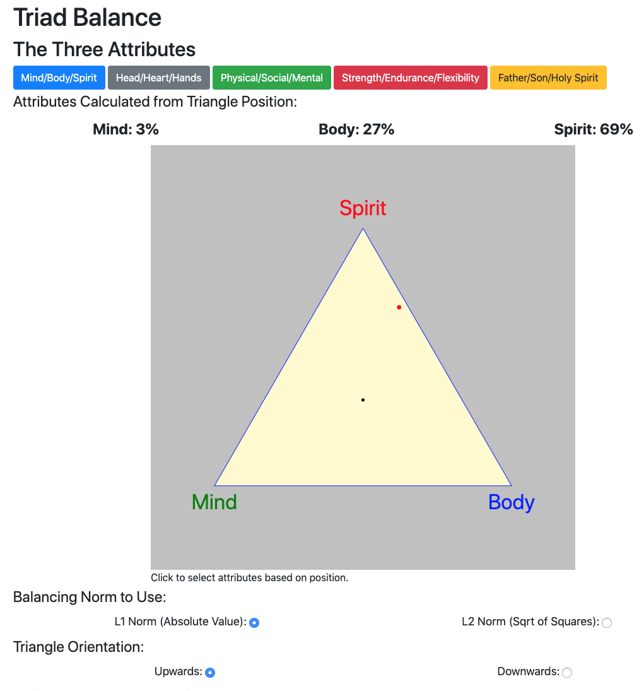

# Triad Balance Interactive, Respsonsive Diagram

Because this is an interactive demo, please go to [https://pubinv.github.io/TriadBalance/TriadBalanceDemo.html](https://pubinv.github.io/TriadBalance/TriadBalanceDemo.html), which has an extensive demo and a <a href="https://jsfiddle.net/RobertLRead/o1vnfrh7/">JSFiddle</a>.

On the demo page you will see something that looks like this:

</img>

# Purpose and Status
<p>
This interactive page presents what may be a new graphical user interface element — the "triad-balance" diagram. The purpose is to use a
single click on a triangle to enter three values such as "Mind/Body/Sprit" or "Strength/Endurance/Flexibility" that are presumed to in some sense
be "in balance", or where it is interesting if they are in balance.
This diagram solves the fundamental problem of converting a point
on such a diagram into a 3-vector of values in a mathematically
consistent and invertible way.
The Triad Balance widget is fully responsive and stylable in css.
It should be easy for any javascript programmer to embed this on
a page. A full test suite and example code should assist in reuse.
</p>

# Usage

To place an interactive diagram on your page:

* Include the file <code>./dist/TriadBalance.js</code> in your HTML.
* Include the file <code>./dist/TriadBalance.css</code> for styling.
* Create an SVG element where you want the diagram.
* Create a callback to receive the data when the diagram is clicked on.
* In your JavaScript, create the initialization object from
your svg element and your callback. Other configuration is
possible, but defaults are given.

This is a minimal example of invocation; for more explanation
see the <a href="https://pubinv.github.io/TriadBalance/TriadBalanceDemo.html">docs</a>.
```javascript
function init() {
  // HERE IS THE INITIALIZATION of the object
  let GLOBAL_SVG_ID = "create_svg";
  TBS = new TriadBalanceState();
  TBS.SVG_ELT = document.getElementById(GLOBAL_SVG_ID);
  TBS.CLICK_CALLBACK = ((tp,tpi,bal) => foo(bal));
  TBS.LABELS = ["Mind", "Body", "Spirit"];

  triadb.initialize_triad_diagram(TBS);
}
```


# Development Usage

TriadBalance is direcly including
an extension of <a href="https://github.com/francisrstokes/vec-la-fp">vec-la-fp</a> by Francis Stokes. This has kept the footprint of this widget very small (< 12K bytes).

There are extensive tests, which are loaded into a file in the browser.
I prefer to use mocha but have found it difficult to make mocha tests
work both the cli and the browser.

  <h2>License</h2>
  <p>
  You are free to reuse this software under the terms
  of the GNU General Public License. Although the code is covered
  by the GPL, the algorithm is not. Please re-code the
  math and algorithm here and use it as you see fit.
  </p>
  <p>
Contact me (&lt;read.robert@gmail.com&gt;) with any questions or comments.    </p>
  <h2> Acknowledgements</h2>
  <p>Thanks to Mark Frazier for the concept and Sean Johnson for a proofread and code review.</p>
